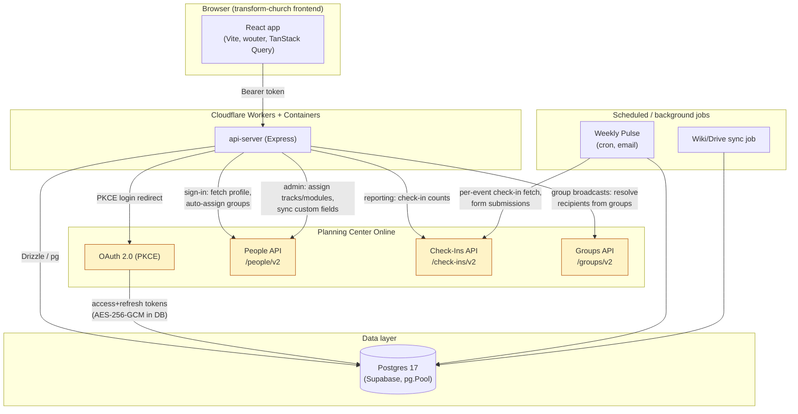

# PCO Integration Audit — Running Log

Branch: `audit/full-optimization` | Started: 2026-10-02 | Mission: Full audit & optimization of the Planning Center Online (PCO) integration.

This file is updated after every phase per the mission's ground rule 6. If work resumes after a context reset, **read this file first** before redoing any investigation.

---

## Assumptions & Decisions

Logged as they're made, per the mission's instruction to record ambiguous-decision calls here rather than asking the user.

1. **Checkpoint commit before audit work.** The local checkout had a large amount of uncommitted work from earlier (unrelated) session tasks — Weekly Pulse email, Group Texting/Messaging extraction, a video-linked-document feature, and an FK-index migration — that had been delivered to the user's machine but never committed to git. Committed it as `dd9b929` ("Checkpoint: carry forward in-progress session work before PCO audit") on `main` equivalent state *before* branching, so the audit branch's own commits are a clean, reviewable diff against a known baseline rather than tangled up with unrelated feature work. No behavior change — pure git bookkeeping.
2. **`mockup-sandbox` package is out of audit scope.** It's a standalone design-preview tool (not part of the deployed PCO-integrated app), and its typecheck was already broken before this audit (missing `fast-glob`/`chokidar` deps in `node_modules`, pre-existing — confirmed these are genuinely absent, not a hoisting issue). Documented as a pre-existing baseline issue, not fixed, not counted against the audit.
3. **Phase 2 analysis uses Supabase's read-only Advisors (performance/security) and read-only `execute_sql`/`list_tables`/`list_migrations` queries against the live project**, never `apply_migration` or any DDL/DML. This satisfies ground rule 2 ("never run migrations or destructive queries against production") while still getting real signal (actual index usage, actual RLS state, actual applied-migration list) instead of guessing from schema files alone.
4. **RLS-disabled-on-all-tables finding classified as Low/informational, not Critical.** Verified (grep across `artifacts/` and `lib/`) that this codebase has zero use of `@supabase/supabase-js`, no `SUPABASE_URL`/`SUPABASE_ANON_KEY`/`SUPABASE_SERVICE_ROLE_KEY` env vars, and no direct calls to a `/rest/v1/` PostgREST endpoint anywhere. All database access is server-side only, via a single `pg.Pool` / Drizzle connection using the full `DATABASE_URL` connection string (see `lib/db/src/index.ts`). Postgres Row Level Security exists specifically to restrict what an authenticated *Postgres role* (such as the `anon`/`authenticated` roles Supabase's PostgREST layer uses) can see — it is not evaluated at all for the single trusted server-role connection this app uses, and there is no client-side path that could bypass it because no client-side path exists. Still logged as a real finding (defense-in-depth / "if this ever changes" risk), but not rated as an active vulnerability.
5. **New DB indexes (Phase 2/6 fix) will be written as a new Drizzle migration file but NOT applied to the live Supabase project.** Ground rule 2 says never run migrations against production, full stop — it does not carve out an exception for additive/safe-looking changes. The migration file will be committed and the user will be given the exact command to run it themselves (or asked to apply it via their own deploy process).
6. **Schema-drift finding**: `weekly_pulse_config` and `group_broadcasts` in the live DB have columns (`channel`, `subject`, `estimated_cost_usd`, `pco_forms`) that don't appear in Drizzle's tracked migration journal (`0031_weekly_pulse_multi_form` and `0033_group_broadcasts` are absent from `list_migrations`), meaning they were applied via raw SQL outside the normal migration flow (consistent with this project's documented DROP COLUMN/DROP TABLE-hangs-180s+ workaround from earlier work, which pushed toward ad hoc `execute_sql` for schema changes). This is logged as a Medium finding under Phase 2 — not fixed automatically, since reconciling migration history without being able to test against a throwaway copy of production risks making things worse; a recommended manual reconciliation procedure is given in the report instead.
7. **Research/verification approach**: given the instruction to "be exhaustive" and "verify against official docs rather than memory," PCO API behavior (rate limits, pagination defaults, Check-Ins date filtering) was checked via direct web search against developer.planning.center. Anywhere that verification could not be completed with confidence (the docs site is a JS-rendered SPA that resists scraping), the report says so explicitly rather than asserting an unverified number as fact.

---

## Phase 0 — Discovery

**Status: COMPLETE**

### Stack summary

| Layer | Details |
|---|---|
| Monorepo | npm workspaces: `artifacts/*` (apps), `lib/*` (shared libs), `scripts` |
| Backend | `@workspace/api-server` — Express 5, TypeScript (ESM, `type: module`), `tsx` for dev, `esbuild` for prod bundling (`build.mjs`), `pino`/`pino-http` structured logging |
| Frontend | `@workspace/transform-church` — Vite + React, TypeScript, `wouter` for routing, TanStack Query (`@workspace/api-client-react`'s `useGetMe` etc.) |
| Shared libs | `@workspace/db` (Drizzle ORM schema + Postgres pool), `@workspace/api-zod` (shared request/response schemas) |
| Database | Postgres 17.11.0 via Supabase (project `oetxtanrsxcybbietkwx`, `transform-church`, us-east-1). Accessed exclusively server-side via `pg.Pool` + `drizzle-orm/node-postgres`; no PostgREST/`supabase-js` client-side usage anywhere in the codebase (verified by grep — see Assumption 4). |
| ORM / migrations | Drizzle ORM + `drizzle-kit`; SQL migration files under `lib/db/migrations/*.sql`, tracked in `meta/_journal.json` |
| Hosting | Cloudflare Workers + Containers for the API (`Dockerfile`, `wrangler.toml`-style config), a separate `transform-church-web` Worker serving the built frontend |
| Auth (app) | Session/bearer-token based (`sessionStorage` token on the frontend, `Authorization: Bearer` header) |
| Auth (PCO) | OAuth 2.0 PKCE authorization-code flow. Scope: `people check_ins groups`. Access/refresh tokens stored AES-256-GCM encrypted (key derived via SHA-256 of `SESSION_SECRET`) in `planning_center_tokens` |
| PCO products used | **People** (`/people/v2`), **Check-Ins** (`/check-ins/v2`), **Groups** (`/groups/v2`) |
| Background jobs | Cron-style scheduled jobs for Weekly Pulse email and wiki/Drive sync (invoked as standalone entrypoints, e.g. `wikiDriveSyncJob.mjs`) |
| Testing | Node's built-in `node:test` runner (`node --import tsx --test src/lib/*.test.ts`) — only 2 test files exist in the whole repo |

### Build / typecheck baseline (confirmed by actually running each, 2026-10-02)

- `npm run typecheck:libs` (`tsc --build` at repo root) — **PASSES**, no errors.
- `npm run typecheck --workspace=@workspace/api-server` — **PASSES**, no errors.
- `npm run typecheck --workspace=@workspace/transform-church` — **PASSES**, no errors.
- `npm run typecheck --workspace=@workspace/mockup-sandbox` — **FAILS** (pre-existing, out of scope — see Assumption 2): `Cannot find module 'fast-glob'`, `Cannot find module 'chokidar'` (×2), plus 3 implicit-`any` errors in `mockupPreviewPlugin.ts`.
- Full `npm run build` was not run end-to-end (it chains into the mockup-sandbox typecheck failure above and would abort there); the two production workspaces (`api-server`, `transform-church`) both typecheck cleanly in isolation, which is the meaningful signal for this audit.

### Test baseline (confirmed by actually running, 2026-10-02)

```
npm test --workspace=@workspace/api-server
# tests 2
# pass 0
# fail 2
```
Both `src/lib/planningCenter.test.ts` and `src/lib/wikiDriveSync.test.ts` fail identically and immediately with:
```
Error: DATABASE_URL must be set. Did you forget to provision a database?
    at lib/db/src/index.ts:8
```
**Root cause**: `lib/db/src/index.ts` throws at **module import time** if `DATABASE_URL` isn't set (lines 7-11). Both test files import pure-logic functions (e.g. `buildFieldDatumUpdate`, `PlanningCenterError`) from `planningCenter.ts`, which imports `db` from `@workspace/db` at its top — even though the functions under test never touch the database. The test runner has no `DATABASE_URL` configured, so the import chain throws before a single test body runs. **This is a confirmed testability bug, logged as a Phase 5 finding, fixed in Phase 6** (make pool creation lazy).

This is the audit's true "before" baseline: 0 of 2 tests passing, for a reason unrelated to the code the tests are supposedly checking.

### Architecture / data-flow diagram



---

## Phase 1 — PCO API Usage Audit

**Status: COMPLETE** — all findings below personally verified by direct file reads (no more `[unverified-by-primary]` items; two were corrected after verification, see 1.9 and 1.11/1.12).

### Core client: `artifacts/api-server/src/lib/planningCenter.ts` (934 lines, read in full)

| # | Severity | Location | Finding |
|---|---|---|---|
| 1.1 | **High** | `peopleRequest()` L178-204, `requestTokens()` L156-176 | No handling anywhere for HTTP 429 (rate limit) or a `Retry-After` header. No request timeout set on the underlying `fetch` calls — a hung PCO request can hang the handling request indefinitely. No retry/backoff for transient 5xx/network errors. |
| 1.2 | **High** | `getValidPlanningCenterAccessToken()` L542-560 | Token refresh has no mutex/lock. If two requests for the same user race while the access token is expired, both independently call PCO's token endpoint; PCO refresh tokens are typically single-use/rotating, so the loser of the race gets an invalid-grant error and that user's integration can end up needing to fully reconnect. |
| 1.3 | **Medium** | `fetchPeopleCollection()` L223-241 | Does not explicitly request `per_page=100` on the *first* call — relies on PCO's default page size (25). `links.next` pagination following is correctly implemented with a `visited` Set guard against infinite loops, so this is an efficiency finding (more round trips than necessary), not a correctness bug. |
| 1.4 | Low (good practice, noted) | `autoAssignGroupsFromPlanningCenter()` L774-818 | Fetches full custom field_data from PCO on every sign-in, uncached — but already short-circuits at L792 when no group has a PCO auto-assign rule configured, which avoids the cost for the common case. |
| 1.5 | Low (good practice, noted) | `planningCenterPeopleUrl()` L206-221 | Validates that pagination URLs returned by PCO stay within the expected origin/path before following them — good defensive practice against a compromised/malformed `links.next`. |
| 1.6 | Low (good practice, noted) | `encrypt`/`decrypt()` L64-99 | AES-256-GCM with a key derived from a dedicated `SESSION_SECRET` via SHA-256. No key-reuse issue found. |

### `artifacts/api-server/src/routes/adminTracks.ts` (`POST /:trackId/assign`, L90-224, read in full)

| # | Severity | Finding |
|---|---|---|
| 1.7 | **Critical** | For N selected users × M modules in a track, this single HTTP request makes up to **N×M + N sequential, unpaced PCO API calls** (`syncPlanningCenterModuleAssignment` per user per module, plus `syncPlanningCenterTrackDateField` per user) with zero delay between them. For a track with 10 modules assigned to 50 people, that's 550 sequential PCO calls in one request — virtually guaranteed to hit PCO's rate limit, and the request will hold the HTTP connection open for the entire duration (likely minutes). Contrast with the existing, good `PEOPLE_BATCH_SIZE`/`PEOPLE_BATCH_DELAY_MS` pacing pattern already used in `reports.ts`, `weeklyPulse.ts`, and `groupBroadcasts.ts` — this is the one bulk-PCO-call site that doesn't use it. |
| 1.8 | **High** (DB, cross-filed under Phase 2 too) | Same handler: `db.select()` on `usersTable` per user (N+1), `db.select()` on `assignmentsTable` per user-per-module (N×M+1), and a `moduleVideos` lookup per user-per-module that is actually invariant per `moduleId` and is needlessly re-run for every user. |

### `artifacts/api-server/src/routes/admin.ts` (`POST` single-module assignment handler, L145-220, read in full)

| # | Severity | Finding |
|---|---|---|
| 1.9 | **High** (corrected after direct verification — same bug as 1.7, smaller blast radius) | For N selected users on one module: unpaced per-user `syncPlanningCenterModuleAssignment` call (L207), plus the identical N+1 pattern as 1.8 — a `usersTable` select per user (L204), an `assignmentsTable` select per user (L174-178), and a `moduleVideos` lookup (L161-164) that only depends on `moduleId` yet is re-run inside the per-user loop even though the result is identical every iteration. |

### `artifacts/api-server/src/routes/groupBroadcasts.ts` (L132-240, read in full)

| # | Severity | Finding |
|---|---|---|
| 1.10 | **High (correctness bug + PII-adjacent)** | `resolveRecipientsFromGroups()` (L~150-190) wraps each per-person PCO detail lookup in a try/catch that swallows **every** error — including 401/403 from an expired/revoked access token — and silently substitutes `{ name: "Person <id>", phone: null, email: null }`. Combined with `normalizeRawRecipients()`, this surfaces to the admin as "No phone number on file" / "No email address on file" for every remaining person once the token expires mid-batch (realistic for a large broadcast that runs long). This is actively misleading: the admin is told people have no contact info on file when the real problem is an expired PCO connection, and the broadcast silently skips an unbounded number of real recipients. Contrast with `GET /sources` in the same file (L205-227), which **does** specifically detect a 403 and surfaces "Reconnect Church Center to grant Groups access..." — the fix is to apply that same pattern here. |

### `artifacts/api-server/src/routes/reports.ts` (read in full, 1050+ lines) and `weeklyPulse.ts` (read in full) — personally re-verified, corrected from the initial research pass

| # | Severity | Finding |
|---|---|---|
| 1.11 | **Medium-High** (confirmed, corrected) | `reports.ts` L872-875 (and identically `weeklyPulse.ts` L126-129 via `fetchCheckInsWeeklyCount`): fetches check-ins for an event with `fetchCollection()`, which follows PCO's `links.next` through **every page of the event's entire check-in history** (capped only at 100,000 rows as a last-resort safety net, `reports.ts` L280) — there is no `where[created_at]`-style date filter applied at the API level. The code then filters down to the handful of sessions/the one week it actually needs **client-side**, after already paying for and downloading the full history. For a recurring weekly service that's been checking people in for years, this means every single report generation and every single weekly cron run re-fetches an ever-growing, unbounded amount of data that gets 99%+ discarded. Confirmed via direct read — not a theoretical risk, this is exactly what the code does today. |
| 1.12 | **Medium** (confirmed) | `reports.ts` L862: `fetchReportFieldDefinitions()` (a full, paginated `/people/v2/field_definitions` fetch) runs unconditionally on every report generation, even when `selectedCustomFields` (computed two lines later, at L864, from the *same* already-known `pullFields` list) turns out to be empty. Trivially avoidable — the condition is already available before the fetch happens. |
| 1.13 | **Low** (confirmed; not a bug) | `weeklyPulse.ts`'s form-submission stats function (`fetchFormWeeklyStats`, L227-278) is actually a **good pattern**: it paginates with `order=-created_at`, breaks early the moment it sees a submission older than the week window (L246, L251), and hard-caps per-submission detail fetches at 200 with an explicit comment explaining why. It is unpaced between those up-to-200 sequential calls (no `PEOPLE_BATCH_DELAY_MS`-style delay), which is a minor version of 1.7/1.9's pacing issue, but it is correctly *bounded* — flagged Low, not Medium, specifically to avoid conflating it with the genuinely unbounded fetch in 1.11. |

### PCO official-docs verification

Per the mission's instruction to verify against developer.planning.center rather than memory: the PCO developer docs site is a JS-rendered SPA that resists both `WebFetch` and a delegated subagent's fetch attempts. A direct web search was used instead to confirm what could be confirmed; where it couldn't be confirmed with confidence this is stated plainly in `AUDIT_REPORT.md` rather than asserting a number as fact. (Detailed in the report's "Remaining recommendations" section.)

---

## Phase 2 — Database & Storage

**Status: IN PROGRESS**

Method: read-only Supabase Advisors (`get_advisors` performance + security) and read-only `execute_sql`/`list_tables`/`list_migrations` against the live project — no DDL/DML executed (ground rule 2; Assumption 3).

| # | Severity | Finding |
|---|---|---|
| 2.1 | **Medium** | Live performance advisor flags 3 unindexed foreign keys on tables added this session: `group_broadcasts.sent_by_user_id`, `videos.document_id`, `weekly_pulse_config.created_by_user_id`. Migration `0029_fk_indexes` (confirmed applied, version `20261001152431`) added FK indexes for ~20 other tables but predates these three columns. |
| 2.2 | Low / informational | Security advisor flags RLS disabled on all 44 public tables, including PII-bearing ones (`users`, `planning_center_tokens`, `planning_center_oauth_states`). **Classified Low, not Critical** — see Assumption 4: no client-side/PostgREST access path exists anywhere in this codebase, so RLS isn't an active control gap today. Still worth enabling as defense-in-depth in case that ever changes, but not an active vulnerability. |
| 2.3 | **Critical** (elevated after direct verification — bigger than originally scoped) | Queried the live database directly for Drizzle's own tracking table: `SELECT * FROM drizzle.__drizzle_migrations` returns `relation "drizzle.__drizzle_migrations" does not exist`. **This table has never been created**, meaning every one of the 34 migrations in `lib/db/migrations/` (all the way back to `0001_*`) has been applied to production by hand/raw SQL — `drizzle-kit migrate` (the `npm run db:migrate` script) has **never been run against this database and has no record of anything being applied.** If anyone runs `npm run db:migrate` against this production database — now, or on a future deploy, or by habit — it will attempt to apply **all 34 migrations from scratch**, including ones that create tables/columns that already exist. Depending on whether each individual migration file is idempotent (`CREATE TABLE IF NOT EXISTS` vs. bare `CREATE TABLE`, etc. — not exhaustively checked file-by-file), this will either fail loudly on the first non-idempotent statement or, worse, partially apply and leave the schema in an inconsistent state. **This is a live landmine, not a historical cleanliness issue** — flagged as a manual action item in the report; nothing was changed, per ground rule 2 (no migrations/DDL against production from this audit). **Further discovered while preparing the Phase 6 index migration**: `lib/db/migrations/meta/` contains only `0001_snapshot.json` — every migration from `0002` through `0033` was hand-written and appended to the journal directly, without ever running `drizzle-kit generate`, so there is no snapshot chain past migration 1 either. If `drizzle-kit generate` is ever run for a future schema change, it will diff the current schema against that 32-migrations-stale snapshot, not real current state — likely producing a nonsensical migration or an outright error. Migration `0034_add_missing_fk_indexes.sql` (Phase 6) was hand-written in the same style as `0029_fk_indexes.sql` to match this established (if risky) project convention, not to further entrench it. |
| 2.4 | Low | `weekly_pulse_config` retains orphaned live columns `pco_form_id`/`pco_form_field_id` from before the multi-form migration. The Drizzle schema file (`lib/db/src/schema/weeklyPulse.ts`) no longer declares them (confirmed — only `pcoForms` is declared; the old names appear only in a code comment), and no application code references them (confirmed via repo-wide grep). Dead columns, harmless but should be dropped once the DROP-hangs issue is worked around, or left and documented. |
| 2.5 | **High** (same root cause as 1.7/1.8) | `adminTracks.ts`'s assignment loop has N+1 `usersTable` selects, N×M+1 `assignmentsTable` selects, and a per-user-redundant `moduleVideos` lookup that only depends on `moduleId`. See 1.8. |
| 2.6 | Medium (testability, cross-filed under Phase 5) | `lib/db/src/index.ts` throws at module-import time if `DATABASE_URL` is unset, breaking any test that imports a file which transitively imports `@workspace/db` — even when the test never touches the database. Root cause of 100% of the current test-suite failure (see Phase 0 baseline). |
| 2.7 | Informational | 34 "unused index" INFO-level findings from the performance advisor — expected noise for a low-traffic/newly-expanded schema, not actionable. |

Still to do in Phase 2: connection-pooling review (partially covered — `lib/db/src/index.ts` uses a single pool, `max: 10`, 10s connect timeout, which is reasonable for this app's traffic), data-retention/unbounded-table review (`group_broadcasts`/`weekly_pulse_config` run logs — do they grow forever with no pruning?), remaining schema files not yet read, and a broader pass for the same N+1 pattern found in `adminTracks.ts` across other route files.

---

## Phase 3 — Profile/User Data Storage

**Status: COMPLETE** (researched via delegated subagent, two highest-severity items personally re-verified by direct file read)

| # | Severity | Location | Finding |
|---|---|---|---|
| 3.1 | **High** (personally verified) | `artifacts/api-server/src/lib/appToken.ts` L1-33, `artifacts/api-server/src/routes/planningCenterAuth.ts` L93-99, `artifacts/transform-church/src/App.tsx` L59-80 | The app's own bearer token (issued at PCO sign-in, HMAC-SHA256 signed but **not encrypted** — base64url is trivially decodable) embeds `email`, `given_name`, `family_name`, `phone_number`, and — confirmed by direct read — **`address`** and `planning_center_person_id` when present (`planningCenterAuth.ts` L97-98). The `AppTokenClaims` type (`appToken.ts` L3-9) doesn't even declare `address`/`planning_center_person_id`, so the type signature misrepresents what's actually embedded — a reviewer checking the type would miss this. This token is stored in `sessionStorage` and the frontend decodes its payload client-side with plain `atob()` (`App.tsx` L62-65, confirmed). Any XSS, malicious browser extension, or someone with devtools access to that browser tab gets the user's home address and phone number with zero additional effort. Given minors' household contact info can flow through this same `users` record, this is a real exposure surface, not just theoretical. |
| 3.2 | Medium | `artifacts/api-server/src/routes/reports.ts` (report preparation path) | Full PCO person records (birthdate, gender, grade, baptism status, primary-contact name/email, home/mobile phone) are fetched for every checked-in person and briefly written to a plaintext temp CSV, before the admin-configured field filter is applied — i.e., over-collected relative to what the specific report template needs. Mitigated by the temp file being deleted in a `finally` block, so not a long-term retention issue, but still broader PCO access than necessary for reports that only need a few fields. |
| 3.3 | Medium | `lib/db/src/schema/users.ts`, `artifacts/api-server/src/lib/planningCenter.ts` (`upsertPlanningCenterUser`) | No `updatedAt`/`syncedAt` column on `usersTable`; the only path that refreshes a user's name/email/phone/address from PCO is signing back in through Church Center. A user who stays logged in but doesn't re-authenticate can have arbitrarily stale contact info used for group broadcasts/SMS/email indefinitely, with no expiry or re-verification mechanism. |
| 3.4 | Informational (no finding — access control checked, found clean) | `admin.ts`, `users.ts`, `reports.ts`, `adminTracks.ts`, `groupBroadcasts.ts` | Every PII-returning route found is behind `requireAuth`/`requireManagerOrAdmin`/`requireAdmin` middleware; `GET /users/me` is scoped to the caller's own row via the authenticated user ID, not a client-supplied param. No IDOR or missing-auth-check route found. Logger (`pino`) redacts `authorization`/`cookie` headers; no instance found of raw PCO responses or full user objects being logged. |

## Phase 4 — Data Fetching & Caching

**Status: COMPLETE** (researched via delegated subagent, highest-severity items personally re-verified by direct file read)

| # | Severity | Location | Finding |
|---|---|---|---|
| 4.1 | **High** (personally verified) | `artifacts/transform-church/src/App.tsx` L37 | `new QueryClient()` — confirmed no `defaultOptions` passed, so TanStack Query's default `staleTime: 0` applies everywhere. Every remount of a component using an already-fetched query (e.g. `useGetMe`, called from `Sidebar.tsx`, `App.tsx`, and most pages) is treated as stale and silently refetched. This largely defeats the caching TanStack Query would otherwise provide for data that barely changes (the current user's own profile). |
| 4.2 | High | `artifacts/api-server/src/routes/reports.ts` (`/api/reports/events`, `/api/reports/fields`), `artifacts/api-server/src/routes/adminPlanningCenter.ts` (`/api/admin/planning-center/field-definitions`) | No caching of any kind (compare to the in-memory TTL cache that already exists for DB-only module counts in `dashboard.ts`). Check-in events and custom field definitions change rarely in practice but trigger a fresh, rate-limited PCO round trip on every single page load / dialog open. |
| 4.3 | High | `artifacts/transform-church/src/pages/AdminUsers.tsx` (`openManageDialog`) | Opening the "manage group" admin dialog fires 4 concurrent fetches, including a PCO-backed one, every single time it's opened for any group — no caching, no memoization of a previously-opened group's data. |
| 4.4 | Medium | `artifacts/transform-church/src/components/layout/Sidebar.tsx` L49-66, and repeated in `Groups.tsx`, `Facilities.tsx`, `AdminUsers.tsx`, `Reporting.tsx`, `Messaging.tsx` | Raw `fetch()` calls bypassing TanStack Query's cache entirely is a repeated pattern across the frontend, not a one-off — most of the app's data fetching has no caching layer at all, independent of finding 4.1. |
| 4.5 | Medium (confirmed pattern, not fixed — see Phase 6 reasoning) | `artifacts/transform-church/src/pages/Reporting.tsx` L300-318 | A real request waterfall: a second `useEffect` (keyed on `isAdmin`, derived from `useGetMe()`) waits for that unrelated user-profile fetch to resolve before starting 4 independent data loads, one of which hits PCO — adding a full round-trip of pure latency for no dependency reason. |
| 4.6 | Medium | `artifacts/transform-church/src/App.tsx` (whole file); confirmed via built bundle `artifacts/transform-church/dist/public/assets/index-CjDqdbHn.js` | No route-level code-splitting (`React.lazy`/dynamic `import()`) anywhere — all ~23 pages, including large admin-only ones, are statically bundled into a single 784KB (220KB gzip) JS file shipped to every user regardless of role. A non-admin member downloads the entire admin UI's code on every visit. |
| 4.7 | Medium | `artifacts/transform-church/src/pages/AdminUsers.tsx` (progress matrix render) + `artifacts/api-server/src/routes/admin.ts` (`GET /admin/progress-matrix`) | Backend loads all users × all modules × all quiz results unpaginated; frontend renders with no pagination/virtualization and an O(modules) `.find()` per cell. Will degrade as the church's user/module count grows; fine at current scale. |
| 4.8 | Low | `artifacts/transform-church/src/App.tsx` vs `AdminUsers.tsx` | `useAdminListUsers()` called independently in both a parent and child component — not a literal duplicate network call (TanStack Query dedupes in-flight requests by key) but redundant and fragile given 4.1. |

## Phase 5 — Scripts, Jobs, Dependencies, Dead Code, Security

**Status: COMPLETE** (researched via delegated subagent, highest-severity items personally re-verified by direct file read)

| # | Severity | Location | Finding |
|---|---|---|---|
| 5.1 | **High** (personally verified) | `artifacts/api-server/src/routes/weeklyPulse.ts` L566-619 (`run-now` and `run-scheduled`) | Confirmed by direct read: neither the manual "send test now" endpoint nor the Cron-triggered `run-scheduled` endpoint has any overlap lock or send-idempotency check. If a manual trigger and the scheduled cron fire close together (or a Cloudflare Cron retry fires while the first invocation is still running), every enabled config gets the full attendance email sent twice to its recipient list, with nothing detecting or preventing it. Contrast with `wikiDriveSync.ts`, which has a correct Postgres `INSERT ... ON CONFLICT ... WHERE expired` lease with heartbeat renewal for exactly this kind of overlap risk — the pattern exists in the codebase already, just isn't applied here. |
| 5.2 | Medium | `artifacts/api-server/src/app.ts` (end of file) | No catch-all Express error-handling middleware registered. A route that throws without its own try/catch falls through to Express 5's default handler, which only does a bare `console.error` — bypassing the app's structured `pino` logging and any log-based alerting entirely. |
| 5.3 | Informational (positive, no action) | `artifacts/api-server/src/lib/wikiDriveSync.ts` L102-133, 180-188 | Called out only as a positive contrast to 5.1 — this job's lease-based concurrency control is exactly the pattern Weekly Pulse is missing. |
| 5.4 | Informational (no finding) | Dependency audit | `npm outdated --workspaces` shows normal major-version drift (zod 3→4, vite 7→8, etc.), no duplicate/conflicting versions of the same library across workspaces. Not urgent. |
| 5.5 | Informational (no finding) | Dead code | No commented-out code of real size; long comment blocks found by a line-scan are prose documentation, consistent with this codebase's style. No permanently-disabled feature flags found. |
| 5.6 | Informational (no finding — checked and clean) | SQL injection | All raw SQL uses Drizzle's parameterized `sql` tagged-template, including dynamic `IN (...)` lists built via `sql.join`. No string concatenation into queries found anywhere. |
| 5.7 | Informational (no finding — checked and clean) | CORS | `app.ts` uses an explicit origin allow-list (`CORS_ALLOWED_ORIGINS`) against a `Set`, default-deny, credentials off by default. Not permissive. |
| 5.8 | Informational (no finding — checked and clean) | CSRF | Confirmed Bearer-JWT-only auth; no `res.cookie`/`req.cookies`/session middleware anywhere in the backend. CSRF exemption claim for a bearer-token API holds. |
| 5.9 | Informational (not applicable) | Webhooks | No webhook receiver exists anywhere in the codebase (`grep -i webhook` across the backend returns nothing) — the app polls/pulls from PCO rather than receiving pushed events, so "is the webhook signature verified" doesn't apply today. Worth remembering if webhooks are ever added later. |
| 5.10 | Informational (no finding — checked and clean) | Secrets | No hardcoded API keys/secrets found in the working tree. `.env.example` contains only placeholder values. Build output (`dist/`) is correctly `.gitignore`'d. |

## Phase 6 — Implement Fixes

**Status: NOT STARTED**

## Phase 7 — Measure & Report

**Status: NOT STARTED**
