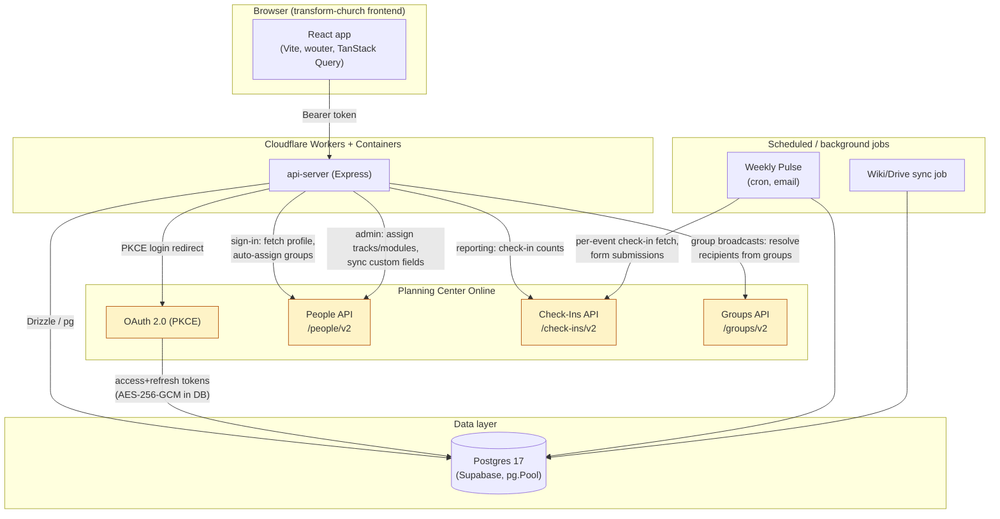

# PCO Integration Audit — Running Log

Branch: `audit/full-optimization` | Started: 2026-10-02 | Mission: Full audit & optimization of the Planning Center Online (PCO) integration.

This file is updated after every phase per the mission's ground rule 6. If work resumes after a context reset, **read this file first** before redoing any investigation.

---

## Assumptions & Decisions

Logged as they're made, per the mission's instruction to record ambiguous-decision calls here rather than asking the user.

1. **Checkpoint commit before audit work.** The local checkout had a large amount of uncommitted work from earlier (unrelated) session tasks — Weekly Pulse email, Group Texting/Messaging extraction, a video-linked-document feature, and an FK-index migration — that had been delivered to the user's machine but never committed to git. Committed it as `dd9b929` ("Checkpoint: carry forward in-progress session work before PCO audit") on `main` equivalent state *before* branching, so the audit branch's own commits are a clean, reviewable diff against a known baseline rather than tangled up with unrelated feature work. No behavior change — pure git bookkeeping.
2. **`mockup-sandbox` package is out of audit scope.** It's a standalone design-preview tool (not part of the deployed PCO-integrated app), and its typecheck was already broken before this audit (missing `fast-glob`/`chokidar` deps in `node_modules`, pre-existing — confirmed these are genuinely absent, not a hoisting issue). Documented as a pre-existing baseline issue, not fixed, not counted against the audit.
3. **Phase 2 analysis uses Supabase's read-only Advisors (performance/security) and read-only `execute_sql`/`list_tables`/`list_migrations` queries against the live project**, never `apply_migration` or any DDL/DML. This satisfies ground rule 2 ("never run migrations or destructive queries against production") while still getting real signal (actual index usage, actual RLS state, actual applied-migration list) instead of guessing from schema files alone.
4. **RLS-disabled-on-all-tables finding classified as Low/informational, not Critical.** Verified (grep across `artifacts/` and `lib/`) that this codebase has zero use of `@supabase/supabase-js`, no `SUPABASE_URL`/`SUPABASE_ANON_KEY`/`SUPABASE_SERVICE_ROLE_KEY` env vars, and no direct calls to a `/rest/v1/` PostgREST endpoint anywhere. All database access is server-side only, via a single `pg.Pool` / Drizzle connection using the full `DATABASE_URL` connection string (see `lib/db/src/index.ts`). Postgres Row Level Security exists specifically to restrict what an authenticated *Postgres role* (such as the `anon`/`authenticated` roles Supabase's PostgREST layer uses) can see — it is not evaluated at all for the single trusted server-role connection this app uses, and there is no client-side path that could bypass it because no client-side path exists. Still logged as a real finding (defense-in-depth / "if this ever changes" risk), but not rated as an active vulnerability.
5. **New DB indexes (Phase 2/6 fix) will be written as a new Drizzle migration file but NOT applied to the live Supabase project.** Ground rule 2 says never run migrations against production, full stop — it does not carve out an exception for additive/safe-looking changes. The migration file will be committed and the user will be given the exact command to run it themselves (or asked to apply it via their own deploy process).
6. **Schema-drift finding**: `weekly_pulse_config` and `group_broadcasts` in the live DB have columns (`channel`, `subject`, `estimated_cost_usd`, `pco_forms`) that don't appear in Drizzle's tracked migration journal (`0031_weekly_pulse_multi_form` and `0033_group_broadcasts` are absent from `list_migrations`), meaning they were applied via raw SQL outside the normal migration flow (consistent with this project's documented DROP COLUMN/DROP TABLE-hangs-180s+ workaround from earlier work, which pushed toward ad hoc `execute_sql` for schema changes). This is logged as a Medium finding under Phase 2 — not fixed automatically, since reconciling migration history without being able to test against a throwaway copy of production risks making things worse; a recommended manual reconciliation procedure is given in the report instead.
7. **Research/verification approach**: given the instruction to "be exhaustive" and "verify against official docs rather than memory," PCO API behavior (rate limits, pagination defaults, Check-Ins date filtering) was checked via direct web search against developer.planning.center. Anywhere that verification could not be completed with confidence (the docs site is a JS-rendered SPA that resists scraping), the report says so explicitly rather than asserting an unverified number as fact.

---

## Phase 0 — Discovery

**Status: COMPLETE**

### Stack summary

| Layer | Details |
|---|---|
| Monorepo | npm workspaces: `artifacts/*` (apps), `lib/*` (shared libs), `scripts` |
| Backend | `@workspace/api-server` — Express 5, TypeScript (ESM, `type: module`), `tsx` for dev, `esbuild` for prod bundling (`build.mjs`), `pino`/`pino-http` structured logging |
| Frontend | `@workspace/transform-church` — Vite + React, TypeScript, `wouter` for routing, TanStack Query (`@workspace/api-client-react`'s `useGetMe` etc.) |
| Shared libs | `@workspace/db` (Drizzle ORM schema + Postgres pool), `@workspace/api-zod` (shared request/response schemas) |
| Database | Postgres 17.11.0 via Supabase (project `oetxtanrsxcybbietkwx`, `transform-church`, us-east-1). Accessed exclusively server-side via `pg.Pool` + `drizzle-orm/node-postgres`; no PostgREST/`supabase-js` client-side usage anywhere in the codebase (verified by grep — see Assumption 4). |
| ORM / migrations | Drizzle ORM + `drizzle-kit`; SQL migration files under `lib/db/migrations/*.sql`, tracked in `meta/_journal.json` |
| Hosting | Cloudflare Workers + Containers for the API (`Dockerfile`, `wrangler.toml`-style config), a separate `transform-church-web` Worker serving the built frontend |
| Auth (app) | Session/bearer-token based (`sessionStorage` token on the frontend, `Authorization: Bearer` header) |
| Auth (PCO) | OAuth 2.0 PKCE authorization-code flow. Scope: `people check_ins groups`. Access/refresh tokens stored AES-256-GCM encrypted (key derived via SHA-256 of `SESSION_SECRET`) in `planning_center_tokens` |
| PCO products used | **People** (`/people/v2`), **Check-Ins** (`/check-ins/v2`), **Groups** (`/groups/v2`) |
| Background jobs | Cron-style scheduled jobs for Weekly Pulse email and wiki/Drive sync (invoked as standalone entrypoints, e.g. `wikiDriveSyncJob.mjs`) |
| Testing | Node's built-in `node:test` runner (`node --import tsx --test src/lib/*.test.ts`) — only 2 test files exist in the whole repo |

### Build / typecheck baseline (confirmed by actually running each, 2026-10-02)

- `npm run typecheck:libs` (`tsc --build` at repo root) — **PASSES**, no errors.
- `npm run typecheck --workspace=@workspace/api-server` — **PASSES**, no errors.
- `npm run typecheck --workspace=@workspace/transform-church` — **PASSES**, no errors.
- `npm run typecheck --workspace=@workspace/mockup-sandbox` — **FAILS** (pre-existing, out of scope — see Assumption 2): `Cannot find module 'fast-glob'`, `Cannot find module 'chokidar'` (×2), plus 3 implicit-`any` errors in `mockupPreviewPlugin.ts`.
- Full `npm run build` was not run end-to-end (it chains into the mockup-sandbox typecheck failure above and would abort there); the two production workspaces (`api-server`, `transform-church`) both typecheck cleanly in isolation, which is the meaningful signal for this audit.

### Test baseline (confirmed by actually running, 2026-10-02)

```
npm test --workspace=@workspace/api-server
# tests 2
# pass 0
# fail 2
```
Both `src/lib/planningCenter.test.ts` and `src/lib/wikiDriveSync.test.ts` fail identically and immediately with:
```
Error: DATABASE_URL must be set. Did you forget to provision a database?
    at lib/db/src/index.ts:8
```
**Root cause**: `lib/db/src/index.ts` throws at **module import time** if `DATABASE_URL` isn't set (lines 7-11). Both test files import pure-logic functions (e.g. `buildFieldDatumUpdate`, `PlanningCenterError`) from `planningCenter.ts`, which imports `db` from `@workspace/db` at its top — even though the functions under test never touch the database. The test runner has no `DATABASE_URL` configured, so the import chain throws before a single test body runs. **This is a confirmed testability bug, logged as a Phase 5 finding, fixed in Phase 6** (make pool creation lazy).

This is the audit's true "before" baseline: 0 of 2 tests passing, for a reason unrelated to the code the tests are supposedly checking.

### Architecture / data-flow diagram



---

## Phase 1 — PCO API Usage Audit

**Status: IN PROGRESS** (core client + highest-severity call sites verified directly; `reports.ts`/`weeklyPulse.ts` findings below are from a delegated research pass and are flagged `[unverified-by-primary]` until cross-checked)

### Core client: `artifacts/api-server/src/lib/planningCenter.ts` (934 lines, read in full)

| # | Severity | Location | Finding |
|---|---|---|---|
| 1.1 | **High** | `peopleRequest()` L178-204, `requestTokens()` L156-176 | No handling anywhere for HTTP 429 (rate limit) or a `Retry-After` header. No request timeout set on the underlying `fetch` calls — a hung PCO request can hang the handling request indefinitely. No retry/backoff for transient 5xx/network errors. |
| 1.2 | **High** | `getValidPlanningCenterAccessToken()` L542-560 | Token refresh has no mutex/lock. If two requests for the same user race while the access token is expired, both independently call PCO's token endpoint; PCO refresh tokens are typically single-use/rotating, so the loser of the race gets an invalid-grant error and that user's integration can end up needing to fully reconnect. |
| 1.3 | **Medium** | `fetchPeopleCollection()` L223-241 | Does not explicitly request `per_page=100` on the *first* call — relies on PCO's default page size (25). `links.next` pagination following is correctly implemented with a `visited` Set guard against infinite loops, so this is an efficiency finding (more round trips than necessary), not a correctness bug. |
| 1.4 | Low (good practice, noted) | `autoAssignGroupsFromPlanningCenter()` L774-818 | Fetches full custom field_data from PCO on every sign-in, uncached — but already short-circuits at L792 when no group has a PCO auto-assign rule configured, which avoids the cost for the common case. |
| 1.5 | Low (good practice, noted) | `planningCenterPeopleUrl()` L206-221 | Validates that pagination URLs returned by PCO stay within the expected origin/path before following them — good defensive practice against a compromised/malformed `links.next`. |
| 1.6 | Low (good practice, noted) | `encrypt`/`decrypt()` L64-99 | AES-256-GCM with a key derived from a dedicated `SESSION_SECRET` via SHA-256. No key-reuse issue found. |

### `artifacts/api-server/src/routes/adminTracks.ts` (`POST /:trackId/assign`, L90-224, read in full)

| # | Severity | Finding |
|---|---|---|
| 1.7 | **Critical** | For N selected users × M modules in a track, this single HTTP request makes up to **N×M + N sequential, unpaced PCO API calls** (`syncPlanningCenterModuleAssignment` per user per module, plus `syncPlanningCenterTrackDateField` per user) with zero delay between them. For a track with 10 modules assigned to 50 people, that's 550 sequential PCO calls in one request — virtually guaranteed to hit PCO's rate limit, and the request will hold the HTTP connection open for the entire duration (likely minutes). Contrast with the existing, good `PEOPLE_BATCH_SIZE`/`PEOPLE_BATCH_DELAY_MS` pacing pattern already used in `reports.ts`, `weeklyPulse.ts`, and `groupBroadcasts.ts` — this is the one bulk-PCO-call site that doesn't use it. |
| 1.8 | **High** (DB, cross-filed under Phase 2 too) | Same handler: `db.select()` on `usersTable` per user (N+1), `db.select()` on `assignmentsTable` per user-per-module (N×M+1), and a `moduleVideos` lookup per user-per-module that is actually invariant per `moduleId` and is needlessly re-run for every user. |

### `artifacts/api-server/src/routes/admin.ts`

| # | Severity | Finding |
|---|---|---|
| 1.9 | **High** `[unverified-by-primary]` | Reported by research pass: a similar per-user unpaced PCO-call loop in a bulk assignment endpoint, same root cause as 1.7. To be re-verified directly before Phase 6 fix. |

### `artifacts/api-server/src/routes/groupBroadcasts.ts` (L132-240, read in full)

| # | Severity | Finding |
|---|---|---|
| 1.10 | **High (correctness bug + PII-adjacent)** | `resolveRecipientsFromGroups()` (L~150-190) wraps each per-person PCO detail lookup in a try/catch that swallows **every** error — including 401/403 from an expired/revoked access token — and silently substitutes `{ name: "Person <id>", phone: null, email: null }`. Combined with `normalizeRawRecipients()`, this surfaces to the admin as "No phone number on file" / "No email address on file" for every remaining person once the token expires mid-batch (realistic for a large broadcast that runs long). This is actively misleading: the admin is told people have no contact info on file when the real problem is an expired PCO connection, and the broadcast silently skips an unbounded number of real recipients. Contrast with `GET /sources` in the same file (L205-227), which **does** specifically detect a 403 and surfaces "Reconnect Church Center to grant Groups access..." — the fix is to apply that same pattern here. |

### `artifacts/api-server/src/routes/reports.ts` and `weeklyPulse.ts` `[unverified-by-primary — to be re-checked before Phase 6]`

| # | Severity | Finding (from delegated research pass) |
|---|---|---|
| 1.11 | Medium | `reports.ts`: unbounded historical check-in fetch (no date-range cap observed) and a redundant field_data fetch performed even when no custom fields are selected for a report. |
| 1.12 | Medium–High | `weeklyPulse.ts` (runs weekly via cron): unbounded per-event check-in fetch, and an unpaced loop of up to ~200 sequential PCO calls for form submissions. Same pacing fix as 1.7/1.9 applies. |

### PCO official-docs verification

Per the mission's instruction to verify against developer.planning.center rather than memory: the PCO developer docs site is a JS-rendered SPA that resists both `WebFetch` and a delegated subagent's fetch attempts. A direct web search was used instead to confirm what could be confirmed; where it couldn't be confirmed with confidence this is stated plainly in `AUDIT_REPORT.md` rather than asserting a number as fact. (Detailed in the report's "Remaining recommendations" section.)

---

## Phase 2 — Database & Storage

**Status: IN PROGRESS**

Method: read-only Supabase Advisors (`get_advisors` performance + security) and read-only `execute_sql`/`list_tables`/`list_migrations` against the live project — no DDL/DML executed (ground rule 2; Assumption 3).

| # | Severity | Finding |
|---|---|---|
| 2.1 | **Medium** | Live performance advisor flags 3 unindexed foreign keys on tables added this session: `group_broadcasts.sent_by_user_id`, `videos.document_id`, `weekly_pulse_config.created_by_user_id`. Migration `0029_fk_indexes` (confirmed applied, version `20261001152431`) added FK indexes for ~20 other tables but predates these three columns. |
| 2.2 | Low / informational | Security advisor flags RLS disabled on all 44 public tables, including PII-bearing ones (`users`, `planning_center_tokens`, `planning_center_oauth_states`). **Classified Low, not Critical** — see Assumption 4: no client-side/PostgREST access path exists anywhere in this codebase, so RLS isn't an active control gap today. Still worth enabling as defense-in-depth in case that ever changes, but not an active vulnerability. |
| 2.3 | **Medium** | Schema/migration drift: `weekly_pulse_config` and `group_broadcasts` have live columns (`pco_forms`, `channel`, `subject`, `estimated_cost_usd`) that correspond to migrations `0031_weekly_pulse_multi_form` / `0033_group_broadcasts`, neither of which appears in `list_migrations`' applied list — meaning they were applied via raw `execute_sql` outside Drizzle's tracked migration flow (consistent with this project's documented DROP-COLUMN-hangs-180s+ workaround, which pushes toward ad hoc SQL for schema changes). A future `drizzle-kit migrate` run against this database could behave unpredictably since the journal doesn't match reality. See Assumption 6. |
| 2.4 | Low | `weekly_pulse_config` retains orphaned live columns `pco_form_id`/`pco_form_field_id` from before the multi-form migration. The Drizzle schema file (`lib/db/src/schema/weeklyPulse.ts`) no longer declares them (confirmed — only `pcoForms` is declared; the old names appear only in a code comment), and no application code references them (confirmed via repo-wide grep). Dead columns, harmless but should be dropped once the DROP-hangs issue is worked around, or left and documented. |
| 2.5 | **High** (same root cause as 1.7/1.8) | `adminTracks.ts`'s assignment loop has N+1 `usersTable` selects, N×M+1 `assignmentsTable` selects, and a per-user-redundant `moduleVideos` lookup that only depends on `moduleId`. See 1.8. |
| 2.6 | Medium (testability, cross-filed under Phase 5) | `lib/db/src/index.ts` throws at module-import time if `DATABASE_URL` is unset, breaking any test that imports a file which transitively imports `@workspace/db` — even when the test never touches the database. Root cause of 100% of the current test-suite failure (see Phase 0 baseline). |
| 2.7 | Informational | 34 "unused index" INFO-level findings from the performance advisor — expected noise for a low-traffic/newly-expanded schema, not actionable. |

Still to do in Phase 2: connection-pooling review (partially covered — `lib/db/src/index.ts` uses a single pool, `max: 10`, 10s connect timeout, which is reasonable for this app's traffic), data-retention/unbounded-table review (`group_broadcasts`/`weekly_pulse_config` run logs — do they grow forever with no pruning?), remaining schema files not yet read, and a broader pass for the same N+1 pattern found in `adminTracks.ts` across other route files.

---

## Phase 3 — Profile/User Data Storage

**Status: NOT STARTED**

## Phase 4 — Data Fetching & Caching

**Status: NOT STARTED**

## Phase 5 — Scripts, Jobs, Dependencies, Dead Code, Security

**Status: NOT STARTED** (two items already surfaced incidentally: 2.6 testability bug; need to check whether any webhooks are received at all, and if so whether signatures are verified)

## Phase 6 — Implement Fixes

**Status: NOT STARTED**

## Phase 7 — Measure & Report

**Status: NOT STARTED**
