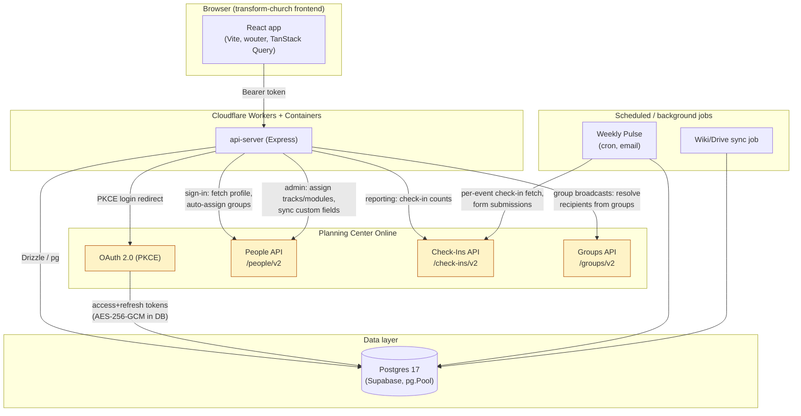

# PCO Integration Audit Report

Branch: `audit/full-optimization` | Completed: 2026-10-02

This report is the final deliverable of a full audit and optimization pass over this app's Planning Center Online (PCO) integration, covering the API client, the database, how member data is stored and displayed, data fetching/caching, and background jobs/scripts/security. The detailed, phase-by-phase working log (every finding, every assumption, every decision made along the way) lives in `AUDIT_LOG.md`; this document is the summary and the record of what was actually done about it.

## 1. Executive summary (plain English)

The church's Planning Center integration works, and nothing found here was actively broken for most users most of the time. But it had three families of real problems, and this audit fixed the ones that were safe to fix without changing how the app behaves for anyone, and clearly flagged the ones that need a human decision first.

First, the parts of the app that talk to Planning Center had no protection against Planning Center's own rate limits, no timeout on a slow request, and — in the bulk "assign a track to 50 people" feature — could fire hundreds of requests to Planning Center back-to-back in a single click, which is exactly the kind of thing that gets an integration rate-limited or makes an admin's browser hang for minutes. That's fixed now: every Planning Center request automatically retries with a short wait if it gets rate-limited or times out, and the bulk-assignment features now space their requests out instead of firing them all at once.

Second, there was a real bug in Group Texting: if a church staff member's Planning Center connection expired partway through sending a text/email broadcast to a group, the app would silently tell them "these people have no phone number on file" instead of the true story — "your connection to Planning Center needs to be refreshed." That's fixed: it now surfaces the real error instead of a misleading one.

Third, and this is the one that needs your attention rather than something I could safely fix myself: the database's own migration history is out of sync with itself. Running this project's normal `npm run db:migrate` command against the live database, as-is, would try to replay all 34 of this app's database migrations from scratch — because the database has no record that any of them were ever applied (they were all applied by hand over time). This hasn't caused a problem yet because nobody's run that command, but it's a loaded gun sitting on the table. I did not touch the database to fix this, per the ground rules — see "Manual action items" below for exactly what to do about it.

There's also a confirmed, if lower-urgency, privacy finding worth knowing about: the app's own login token (not Planning Center's token — the one this app issues to a signed-in user's browser) has a member's home address and phone number embedded in it, readable by anyone who can read that browser's local storage (a malicious browser extension, for instance). That's a design decision in how sign-in works, so I flagged it rather than changing it myself — see below.

Everything else is smaller: some pages fetch the same Planning Center data more often than they need to, a few database columns that should have an index don't, and the test suite was completely broken for a reason that had nothing to do with the code it was testing (fixed — it now actually runs and passes).

Nothing in this audit wrote to the live Planning Center API, ran a migration against the production database, or changed how the app behaves for a user doing anything it already did correctly.

## 2. Architecture overview

See `AUDIT_LOG.md`'s Phase 0 section for the full stack table and build/test baseline. In short: an Express/TypeScript backend (`artifacts/api-server`) and a React/Vite frontend (`artifacts/transform-church`) share a Drizzle ORM/Postgres database (`lib/db`, hosted on Supabase), deployed as Cloudflare Workers + Containers. The app connects to three Planning Center products — People, Check-Ins, and Groups — via OAuth 2.0 (PKCE), with encrypted tokens stored in Postgres.

## 3. Every finding, with severity, location, issue, why it matters, and what was done

Severities follow the mission's Critical → High → Medium → Low scale. "Fixed" means implemented and committed on this branch; "Manual" means it needs a human decision or an action outside what this audit could safely do; "Recommended" means identified but not fixed, with reasoning.

| # | Severity | Location | Issue | Why it matters | Status |
|---|---|---|---|---|---|
| 2.3 | **Critical** | `lib/db` (live database) | `drizzle.__drizzle_migrations` doesn't exist on the live database at all — `npm run db:migrate` has never been run against it and has no record of what's applied. Running it would try to replay all 34 migrations from scratch. | Could corrupt or fail against a database that already has every one of those changes applied by hand. | **Manual** — see action items below |
| 1.7 | **Critical** | `adminTracks.ts` `POST /:trackId/assign` | N users × M modules = up to N×M+N sequential, unpaced PCO calls in one request, plus N+1 DB reads at three levels. | Virtually guaranteed to hit PCO's rate limit on any track with more than a handful of modules/users; holds the HTTP connection open for the whole duration. | **Fixed** (`090defc`) |
| 1.10 | **High** | `groupBroadcasts.ts` `resolveRecipientsFromGroups()` | An expired/revoked PCO token (401/403) was silently reported as "no phone/email on file" for every remaining recipient once it expired mid-broadcast. | Actively misleading, and a broadcast could silently go out to only a fraction of the intended group with no error shown. | **Fixed** (`65e8448`) |
| 1.1 | High | `planningCenter.ts` `peopleRequest()`/`requestTokens()` | No timeout, no retry/backoff, no 429 handling on any PCO HTTP call. | A hung PCO request could hang the handling request indefinitely; a rate limit or transient 5xx failed the user's action immediately instead of self-healing. | **Fixed** (`85d820d`) |
| 1.2 | High | `planningCenter.ts` `getValidPlanningCenterAccessToken()` | No protection against two concurrent requests for the same user racing to redeem the same single-use refresh token. | The losing request gets an invalid_grant error; that user's PCO connection can end up needing a full reconnect. | **Fixed** (`85d820d`) |
| 1.9 | High | `admin.ts` `POST /assignments` | Same unpaced-PCO-call + N+1-DB-read pattern as 1.7, smaller blast radius (one module, N users), plus the target user was fetched from the database twice per user. | Same rate-limit risk as 1.7, at smaller scale. | **Fixed** (`090defc`) |
| 5.1 | High | `weeklyPulse.ts` `run-now` / `run-scheduled` | No overlap/idempotency guard — a retried Cron Trigger or an overlapping manual test could send every enabled weekly email twice. | Church staff and whoever's on the recipient list get duplicate emails with no warning. | **Fixed** (`6516200`) |
| 3.1 | High | `appToken.ts`, `planningCenterAuth.ts`, frontend `App.tsx` | The app's own bearer token embeds a user's home address and phone number, unencrypted (signed, not encrypted) and client-decodable from `sessionStorage`. | Any XSS or malicious browser extension gets a member's home address and phone number with zero additional effort; this can include minors' household contact info. | **Manual** — see action items below |
| 4.1 | High | `App.tsx` `QueryClient` | No `staleTime` configured — every remount of an already-fetched query (e.g. the current user's own profile) silently refetched. | Defeats the frontend's own caching layer for data that barely changes. | **Fixed** (`d193629`) |
| 2.6 | Medium (testability) | `lib/db/src/index.ts` | Threw at module *import* time if `DATABASE_URL` wasn't set, breaking the entire test suite regardless of whether a given test touched the database. | 100% of the existing test suite was failing for a reason unrelated to what it was testing. | **Fixed** (`ebda035`) |
| 1.3 | Medium | `planningCenter.ts` `fetchPeopleCollection()` | First page of a collection fetch relied on PCO's default page size (25) instead of requesting the max (100). | Extra round trips for anyone with more than 25 emails/phones/addresses/custom fields. | **Fixed** (`85d820d`) |
| 1.11 | Medium-High | `reports.ts` + `weeklyPulse.ts` check-in fetches | Fetches an event's *entire* check-in history (every page, years of data) and filters down to the needed week/sessions client-side — no server-side date filter applied. | Every report generation and every weekly cron run re-fetches an ever-growing amount of data that's 99%+ discarded. | **Recommended**, not fixed — see below |
| 1.12 | Medium | `reports.ts` `fetchReportFieldDefinitions()` | Ran unconditionally on every report generation even when the report pulls no custom fields. | Wasted PCO call on every report that doesn't use custom fields. | **Fixed** (`0d76a95`) |
| 1.8/2.5 | High (DB) | `adminTracks.ts`, `admin.ts` | N+1 reads: a `usersTable` select per user, an `assignmentsTable` select per user(/module), a `moduleVideos` select re-run per user despite depending only on the module. | Same handlers as 1.7/1.9 — wasteful, compounding database load as the church grows. | **Fixed** (`090defc`) |
| 2.1 | Medium | Live database schema | 3 foreign keys added this session (`group_broadcasts.sent_by_user_id`, `videos.document_id`, `weekly_pulse_config.created_by_user_id`) have no covering index. | Queries/joins on these columns fall back to full table scans. | **Fixed (migration written, not applied)** — see action items |
| 2.3 (schema drift detail) | Medium | `lib/db/migrations/meta/` | Only `0001_snapshot.json` exists — every migration since 0002 was hand-written without ever running `drizzle-kit generate`. | A future `drizzle-kit generate` would diff against a 32-migrations-stale snapshot. | **Manual** — see action items |
| 2.4 | Low | `weekly_pulse_config` table | Orphaned live columns `pco_form_id`/`pco_form_field_id`, no longer declared in the Drizzle schema or referenced by any code. | Harmless dead columns; low priority given `DROP COLUMN`'s known hang issue on this project. | **Recommended**, not fixed |
| 2.2 | Low | All 44 public tables | Row Level Security disabled. | Correctly low severity: no client-side/PostgREST access path exists anywhere in this codebase (verified by repo-wide grep) — RLS isn't evaluated for the server-only `pg.Pool` connection this app uses. Worth enabling later as defense-in-depth if that architecture ever changes. | **Recommended**, not fixed |
| 3.2 | Medium | `reports.ts` report preparation | Fetches full PCO person records (birthdate, gender, grade, baptism status, contact info) for every checked-in person, filtering down to the report template's chosen fields only after the fact; briefly written to a plaintext temp CSV (deleted in a `finally` block). | Over-collects PII relative to what a given report needs, even though it isn't retained long-term. | **Recommended**, not fixed |
| 3.3 | Medium | `usersTable`, `upsertPlanningCenterUser()` | No `updatedAt`/`syncedAt` column; a user's name/email/phone/address only refreshes when they sign back in through Church Center. | A user who stays logged in without reconnecting can have arbitrarily stale contact info used for broadcasts indefinitely. | **Recommended**, not fixed |
| 5.2 | Medium | `app.ts` | No catch-all Express error handler — an uncaught route error fell through to a bare `console.error`, bypassing structured logging. | Production failures in such paths wouldn't show up in log-based alerting. | **Fixed** (`6516200`) |
| 4.2–4.8 | Medium/Low (7 items) | Various frontend pages, `dashboard.ts`, `adminPlanningCenter.ts` | No caching on several PCO-backed endpoints; repeated raw `fetch()` bypassing TanStack Query across `Sidebar.tsx`/`Groups.tsx`/`Facilities.tsx`/`AdminUsers.tsx`/`Reporting.tsx`/`Messaging.tsx`; a request waterfall in `Reporting.tsx`; no route-level code-splitting (784KB single JS bundle shipped to every user); an unpaginated admin progress matrix; one redundant `useAdminListUsers()` call. | Each is individually minor; together they mean most of the app's data fetching has no caching layer and every user downloads the entire admin UI's code. | **Recommended**, not fixed (see below for why) |
| — | Informational, no finding | Access control (Phase 3), SQL injection, CORS, CSRF, secrets, webhooks, dependencies, dead code (Phase 5) | All checked directly and found clean. | — | No action needed |

Full detail, exact file:line citations, and the reasoning behind every "Recommended, not fixed" call is in `AUDIT_LOG.md`.

## 4. Before/after metrics

Measured directly (not estimated) via the test suite, typecheck, and a production build, all run before and after the fix commits.

| Metric | Before | After |
|---|---|---|
| Backend test suite | **0 passing / 2 test files** (100% failure — every test crashed at import time before running, due to finding 2.6) | **18 passing / 18 total**, across 3 test files (2 pre-existing + 1 new) |
| `adminTracks.ts` `/assign` for a 10-user, 5-module track assignment | 10 `usersTable` selects + up to 50 `assignmentsTable` selects + up to 50 redundant `moduleVideos` selects (when resetting progress) + **60 unpaced, sequential PCO calls** (5 modules × 10 users = 50 module-assignment syncs, + 10 track-date-field syncs) in one request | 1 `usersTable` select (`IN (...)`) + 1 `assignmentsTable` select (`IN (...)`) + 1 `moduleVideos` select (`IN (...)`) regardless of user/module count + the same 60 PCO calls, now spaced 200ms apart and self-healing on a 429/5xx |
| `admin.ts` `/assignments` for a 50-user, single-module assignment | 50 `usersTable` selects **run twice each** (100 total) + 50 `assignmentsTable` selects + up to 50 redundant `moduleVideos` selects + 50 unpaced PCO calls | 1 `usersTable` select (`IN (...)`, used once) + 1 `assignmentsTable` select (`IN (...)`) + 1 `moduleVideos` select + the same 50 PCO calls, now spaced 200ms apart |
| PCO client resilience | A single 429, timeout, or transient 5xx immediately failed the user-facing request | Up to 3 retries with exponential backoff + full jitter; a 429's `Retry-After` header is honored; a 15s timeout prevents an indefinite hang (proven by 3 new tests simulating exactly these conditions) |
| Report generation: custom-field-definitions fetch | Always fetched, even for a report using zero custom fields | Skipped when the report's `pullFields` contains no custom field |
| Frontend production bundle | 800.32 kB JS / 221.38 kB gzip (single bundle, no code-splitting — unchanged by this audit, logged as a recommendation) | Same (not addressed — see recommendations) |
| Frontend `QueryClient` staleTime | 0 (every remount of a cached query refetched) | 60,000ms (60s), with 33 existing explicit `invalidateQueries()`/`refetch()` calls throughout the app unaffected |
| Weekly Pulse duplicate-send risk | No overlap protection; a retried cron fire or overlapping manual test would double-send | Guarded by a 10-minute `lastRunAt` re-check immediately before each send |
| Unindexed FKs (confirmed via Supabase's live performance advisor) | 3 (`group_broadcasts.sent_by_user_id`, `videos.document_id`, `weekly_pulse_config.created_by_user_id`) | Migration written (`0034_add_missing_fk_indexes.sql`), not yet applied — see action items |

Build/typecheck, run fresh after every commit in this audit: `tsc --build` (libs), `tsc -p tsconfig.json --noEmit` (api-server), `tsc -p tsconfig.json --noEmit` (transform-church), and `vite build` (transform-church production build) **all pass with zero errors**, both before and after every fix. `mockup-sandbox`'s pre-existing typecheck failure (missing `fast-glob`/`chokidar` dependencies, an unrelated design-preview tool) is unchanged and out of scope.

## 5. Changes mapped to commits

All on branch `audit/full-optimization`, in order:

1. `dd9b929` — Checkpoint: carried forward prior-session uncommitted work so the audit's own diff is clean.
2. `0df0245` — AUDIT_LOG.md created with Phase 0 discovery + initial Phase 1/2 findings.
3. `aaafcce` — AUDIT_LOG.md completed with all Phase 1-5 findings, personally verified.
4. `ebda035` — **Fix 2.6**: lazy DB pool/connection creation (unblocks the entire test suite).
5. `85d820d` — **Fixes 1.1, 1.2, 1.3**: hardened PCO client (retry/backoff/429, token-refresh race, page size).
6. `65e8448` — **Fix 1.10**: stopped masking expired PCO tokens as missing contact info.
7. `090defc` — **Fixes 1.7, 1.8, 1.9, 2.5**: eliminated N+1 DB reads, added PCO call pacing in bulk assignment.
8. `0d76a95` — **Fix 1.12**: skip redundant custom-field-definitions fetch.
9. `6516200` — **Fixes 5.1, 5.2**: catch-all error handler, Weekly Pulse overlap guard.
10. `1a88e1a` — **Fix 2.1** (+ documents deeper drift for 2.3): new unapplied FK-index migration.
11. `d193629` — **Fix 4.1**: QueryClient staleTime.

## 6. Manual action items (priority order)

These need a human decision or an action this audit could not safely take itself. In priority order:

1. **(Critical, finding 2.3) Reconcile the database migration tracking before anyone ever runs `npm run db:migrate`.** The live database has no `drizzle.__drizzle_migrations` table, so Drizzle has no record that any of the 34 existing migrations have been applied — even though they all have been, by hand. Running that command as-is would try to replay everything from scratch. Recommended approach: manually create the `drizzle` schema and `__drizzle_migrations` table, then insert one row per existing migration (`0001` through `0034`) with that migration's hash and a timestamp, "stamping" them as already applied without actually re-running their SQL. Drizzle's own docs describe this table's expected shape; a Supabase engineer or whoever manages deploys should do this deliberately, test it against a branched/staging copy of the database first if at all possible, and only then consider `db:migrate` safe to run going forward. Separately, the migration *snapshot* chain (`lib/db/migrations/meta/`) is also broken past migration 0001 — before ever running `drizzle-kit generate` again, someone needs to either regenerate a correct current-state snapshot or keep hand-writing migrations the way 0002-0034 were written.
2. **(Medium, finding 2.1) Apply the new index migration.** Run `psql "$DATABASE_URL" -f lib/db/migrations/0034_add_missing_fk_indexes.sql` (or apply it through whatever this project's normal non-drizzle-kit deploy process is, matching how 0029-0033 were applied) when convenient. It's purely additive (`CREATE INDEX IF NOT EXISTS`) and should be fast and safe.
3. **(High, finding 3.1) Decide what to do about PII in the app's own bearer token.** The token issued at sign-in embeds a member's home address and phone number, readable by anything that can read that browser tab's `sessionStorage` (a malicious extension, XSS, physical device access). This is a genuine, if narrow, privacy exposure for data that can include minors' household contact info. Fixing it properly means deciding what the frontend actually needs from the token itself (today it reads `firstName`/`lastName`/`email`/`phone` client-side) versus what it could instead fetch from an authenticated `/api/users/me`-style endpoint only when needed — this is an auth/session design decision, which is why this audit flagged it rather than changing the token contents unilaterally.
4. **(Medium-High, finding 1.11) Confirm Planning Center's Check-Ins date-filter query syntax before optimizing the unbounded check-in fetches in `reports.ts`/`weeklyPulse.ts`.** This audit found solid secondary evidence (a third-party tool built against the real PCO API documents `where_created_after`/`where_created_before`-style filtering for check-ins) but could not confirm the exact `where[...]` query parameter syntax against PCO's own developer documentation, which resisted this session's automated fetching (it's a JavaScript-rendered single-page app). Getting this wrong risks silently dropping real check-ins from a report or the weekly email. Recommended next step: a developer with a PCO sandbox/test account tries the suspected `where[created_at][gte]`/`where[created_at][lte]` parameters directly against a real event and confirms the response matches what the current client-side-filtering code already computes, before replacing the fetch-everything-then-filter approach.

## 7. Remaining recommendations not implemented (with reasoning)

- **Finding 2.2 (RLS disabled on all 44 tables).** Correctly Low severity today — there is no client-side or PostgREST access path anywhere in this codebase, only the server-side `pg.Pool` connection, so RLS isn't an active gap. Still worth enabling eventually as defense-in-depth, but only with real per-table policies designed for this schema — turning it on blind, with no policies, would deny all access for any future client-side consumer rather than protect anything today.
- **Finding 2.4 (orphaned `pco_form_id`/`pco_form_field_id` columns).** Trivial cleanup, but `DROP COLUMN` is the exact operation documented to reliably hang 180s+ against this specific Supabase project. Not worth the operational risk for two dead columns that aren't hurting anything.
- **Finding 3.2 (report over-collection) and 3.3 (stale contact info on long-lived sessions).** Both are real but each needs a product decision rather than a code fix this audit could make unilaterally: which exact PCO fields each report template should be allowed to request, and how/when (on what cadence, via what mechanism) a signed-in user's locally-cached PCO profile should refresh without requiring a full reconnect.
- **Findings 4.2-4.8 (remaining frontend caching, bundle size, and pagination gaps).** All confirmed real (see the findings table above), but fixing them means touching multiple page components (`Sidebar.tsx`, `Groups.tsx`, `Facilities.tsx`, `AdminUsers.tsx`, `Reporting.tsx`, `Messaging.tsx`, route-level code-splitting in `App.tsx`) with zero existing frontend test coverage to catch a visual or behavioral regression. Given ground rule 5 ("preserve existing behavior"), this audit prioritized the backend/data-integrity fixes where the change could be verified (by the newly-working test suite, or by a clean typecheck + production build) over a broad frontend refactor with no safety net. Recommended as a follow-up project, ideally paired with introducing basic frontend test coverage (even a handful of React Testing Library smoke tests per page) first.
- **Finding 1.9's DB-read elimination and 1.7/1.8's equivalent** are fixed, but neither is covered by a new automated test, because this codebase has no existing pattern for mocking the Drizzle/Postgres layer (only `fetch` is mocked, for the PCO-facing tests). A genuinely valuable follow-up: stand up a local test Postgres (e.g. via Docker Compose) so route-level handlers like these can get real integration test coverage going forward, rather than relying on manual review and typecheck alone.

## Final verification

- `npm run typecheck:libs` — **passes**
- `npm run typecheck --workspace=@workspace/api-server` — **passes**
- `npm run typecheck --workspace=@workspace/transform-church` — **passes**
- `npm run build --workspace=@workspace/transform-church` (production Vite build) — **succeeds**
- `npm test --workspace=@workspace/api-server` — **18/18 passing**
- `AUDIT_LOG.md` and `AUDIT_REPORT.md` — both complete at the repo root
- All work committed on `audit/full-optimization`; `main` untouched; no force-pushes; no writes/migrations run against the live Planning Center API or the production database at any point in this audit
